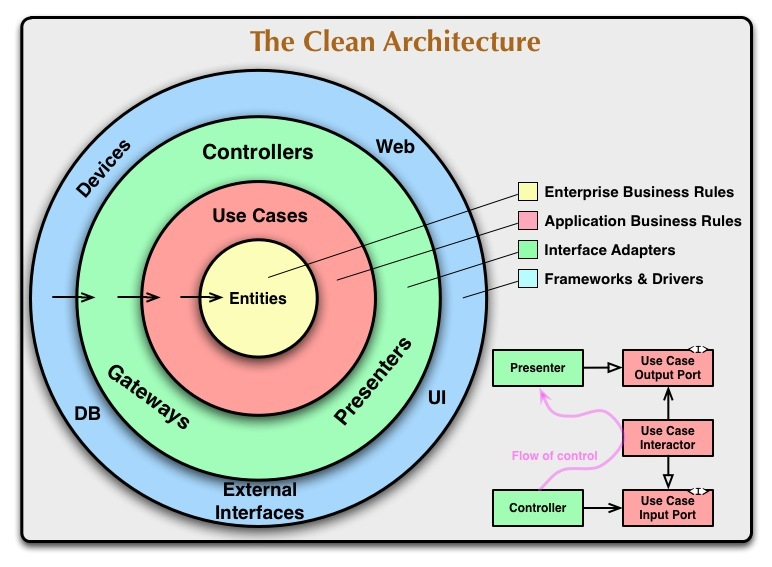

# 클린 아키텍쳐 with Spring boot


### 클린 아키텍처
많은 아키텍처의 목적은 `관심사 분리`이다.  
관심사를 계층별로 분리하여 각 계층이 하는 역할을 명확히 한다.  
클린 아키텍처는 아래와 같은 목적을 가지고 있다.

1. 프레임워크와 독립적
2. 테스트의 용이함
3. UI와 독립적
4. DB와 독립적
5. 외부 기능과 독립적

쉽게 말하면 프레임워크나 DB, UI가 어떤 것으로 바뀌어도 비즈니스 로직의 변경이 있으면 안 된다는 의미다.

<br>

### 의존 규칙

클린 아키텍처에서 의존 규칙은 안쪽을 향해야한다.  
안쪽의 원은 바깥족 원에 대해 알 수 없어야 한다.  
마찬가지로 바깥족 원에서 사용하는 데이터 포멧 또한 안쪽의 원에서 사용하지 않아야 한다.  
  
즉, 안쪽은 바깥과는 무관한 역할을 수행해야 한다는 말이다.



<br>

## 예제 구현

### Entity 
엔팉티는 **가장 일반적이고 고수준의 규칙**을 캡슐화 한다. 애플리케이션의 동작(시나리오)의 변경이 해당 계층에 영향을 주면 안된다.

```java
@Getter
@AllArgsConstructor
public class Post {
    private final String title;
    private final String content;
    private final LocalDate createdAt;
    private int view;
    private boolean isDeleted;
    private final boolean isPublic;

    public boolean canShow() {
        return !isDeleted && isPublic;
    }

    public void delete() {
        this.isDeleted = true;
    }

    public void increaseView() {
        this.view += 1;
    }
}
```
위와 같이 Post 클래스에선 3가지 메서드를 제공한다. 해당 글이 보일 수 있는가, 글 삭제, 조회수 증가 같은 메서드다.  
  
시나리오의 변경에 따라 해당 글의 메서드가 바뀌는가? 아니다. 만약 중복된 회원일 경우 1시간마다 1개의 view가 올라가던 동작이 2시간마다 1개의 view가 올라가던 동작이 2시간마다 1개의 view가 올라가는 동작으로 바뀐다고 해서 increaseView메서드가 바뀌는 점은 없다.

<br>

### UseCase
애플리케이션의 비즈니스 규칙을 캡슐화한다. 해당 계층의 변경은 엔티티 계층에 영향을 주어선 안되며 UI, 프레임워크 등의 변경이 해당 계층의 영향을 주어선 안된다.  
  
단 애플리케이션의 동작이 변경되었을 땐 해당 계층이 영향을 받습니다. 계층은 Entity의 비즈니스 로직을 애플리케이션 동작에 따라 실행한다.  
  
UseCase 계층을 추상화한 인터페이스를 inputBoundary라고 한다.
```java
public interface FindVisiblePostsInputBoundary {
    List<PostResponseModel> create();
}
```
UseCase 계층을 InputBoundary의 구현체를 Interactor라고 한다.

```java
@Service
public class FindVisiblePostsInteractor implements FindVisiblePostsInputBoundary {
    private final PostGateway postGateway;

    public FindVisiblePostsInteractor(PostGateway postGateway) {
        this.postGateway = postGateway;
    }

    @Override
    public List<PostResponseModel> create() {
        List<PostGatewayResponseModel> postGatewayResponseModels = postGateway.findAll();

        List<Post> posts = postGatewayResponseModels
                .stream()
                .map(PostGatewayResponseModel::fromThis)
                .collect(Collectors.toList());

        List<PostResponseModel> postResponseModels = posts
                .stream()
                .filter(Post::canShow)
                .map(PostResponseModel::of)
                .collect(Collectors.toList());

        return postResponseModels;
    }
}
```

canShow 메서드를 통해 보일 수 있는 게시글을 필터링하여 보여줍니다. 만약 모든 글을 조회한다면 canShow메서드를 실행하지 않으면된다.

<br>

### Interface Adapter
인터페이스 어댑터는 쉽게 말해 엔티티, 유즈 케이스 계층이 다루기 편한 데이터 포맷에서 UI, DB가 다루기 편한 데이터 포맷으로 바꿔주는 역할이다.  
  
인터페이스 어댑터를 추상화하기 위한 인터페이스다.

```java
public interface PostGateway {
    void create(CreatePostGatewayRequestModel createPostGatewayRequestModel);
    List<PostGatewayResponseModel> findAll();
}
```
JPA를 사용하기 위해 테이블 클래스르 정의합니다. 해당 포맷으로 변경하는 역할을 인터페이스 어댑터가 수행합니다.

```java
@Entity
@Table(name = "post")
@Getter
@NoArgsConstructor
@AllArgsConstructor
public class PostTable {
    @Id
    @GeneratedValue(strategy = GenerationType.IDENTITY)
    private Long id;

    @Column(name = "title")
    private String title;

    @Column(name = "content")
    private String content;

    @Column(name = "created_at")
    private LocalDate createdAt;

    @Column(name = "view")
    private Integer view;

    @Column(name = "is_deleted", columnDefinition = "tinyint")
    private Boolean isDeleted;

    @Column(name = "is_public", columnDefinition = "tinyint")
    private Boolean isPublic;
}
```

해당 구현체의 이름은 JPAPost입니다. 그렇기 때문에 JPA에서 사용할 데이터 포맷으로 변경해줍니다.  
  
JPA가 아닌 다른 ORM을 사용한다면 PostGateway를 상속받은 클래스를 구현하여 UseCase의 변경 없이 사용할 수 있습니다.

```java
@Service
public class JPAPost implements PostGateway {
    private final JPAPostRepository JPAPostRepository;

    public JPAPost(JPAPostRepository JPAPostRepository) {
        this.JPAPostRepository = JPAPostRepository;
    }

    @Override
    public void create(CreatePostGatewayRequestModel createPostGatewayRequestModel) {
        this.JPAPostRepository.save(new PostTable(
                null,
                createPostGatewayRequestModel.getTitle(),
                createPostGatewayRequestModel.getContent(),
                createPostGatewayRequestModel.getCreatedAt(),
                createPostGatewayRequestModel.getView(),
                createPostGatewayRequestModel.isDeleted(),
                createPostGatewayRequestModel.isPublic()
        ));
    }

    @Override
    public List<PostGatewayResponseModel> findAll() {
        return JPAPostRepository.findAll()
                .stream()
                .map(postTable -> new PostGatewayResponseModel(
                        postTable.getTitle(),
                        postTable.getContent(),
                        postTable.getCreatedAt(),
                        postTable.getView(),
                        postTable.getIsDeleted(),
                        postTable.getIsPublic()
                ))
                .collect(Collectors.toList());
    }
}

```

JPARepository를 선언해 사용한다.

```java
@Repository
public interface JPAPostRepository extends JpaRepository<PostTable, Long> {
}
```

<br>

### 프레임워크, 드라이버
프레임워크, DB, 드라이버 등을 말한다. 가장 외부에 위치해 안쪽의 동심원에 영향을 주지 않는다.

### 4개의 원?
모든 클린아키텍처 글에서 질문하고 답변하는 질문입니다. 클린 아키텍처 원문에 나와있는 질문이기 때문이다. 물론 4개가 아니어도 된다. 단, 의존 규칙은 바깥에서 안으로 흘러가야한다.