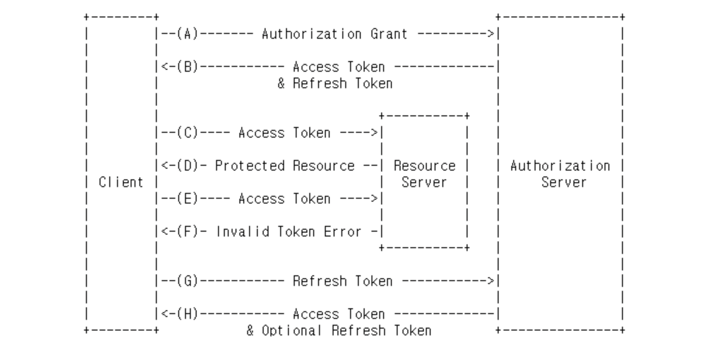

# Spring Security AccessToken & RefreshToken

### What is an Access Token?
사적 리소스에 접근하는 REST API에 대한 요청에 토큰이 포함되어 있는 지 , 또 해당 토큰이 유효한지의 여부를 검증함으로써 인증 절차(로그인)을 수행할 때 사용하는 토큰을 AccessToken 이라고 합니다.  
  
Access Token은 수명이 있다.
수명이 끝나면 해당 토큰을 이용하여 API 서버에 데이터를 요청했을 때 API 서버는 더이상은 정보를 제공하지 않는다.
그래서 AccessToken을 재발급 받아야한다.
  
그러나 그때마다 사용자에게 다시 로그인을 하라고 하기에는 무리가 있다. 주변을 보아도 아무리 오랜 시간 로그인을 유지하면서 지속적으로 사이트를 사용하여도 로그아웃 돼버리는 사이트는 없다.  
  
그렇다고 `Access Token`의 수명을 길게하거나 무한정으로 해버린다면 악의를 품은 공격자가 이를 악용할 가능성이 커진다.(극단적으로 Access Token의 유효기간이 5초라고 하면, 확실히 공격자가 이 토큰을 가지고 뭔가 한다는 것은 힘든일일 것이다.)  
  
**따라서 Access Token의 수명은 너무 짧지 않은 시간으로 유지시키되, 그렇다고 빈번하게 로그아웃이 일어나지 않게 해야 한다.**
  
바로 이러한 경우에 손쉽게 새로운 Access Token을 발급받을 수 있는 방법이 `Refresh Token`이다.

> 보통의 Spring project 라면 AuthorizationServer, ResourceServer를 같은 API 서버단으로 구현한느 경우가 있을 것이다. 그러한 경우를 AuthorizationServer를 Security단으로, ResourceServer를 RestController단으로 생각하고 흐름을 파악하자.

- Client가 로그인(과정A)를 통해 권한을 획득할 때 Access Token과 함께 RT를 발급(과정B) 받는다.
- 그러면 Client는 AccessToken과 RefreshToken을 모두 저장하고 있다가. API를 호출(과정C)할 대에는 AccessToken을 제출하여 자원을 받아오게 된다(과정D)
- 시간이 흘러 마찬가지로 AccessToken을 이용하여 자원을 받아오려는데(과정E), Invalid Token Error가 뜨면서(과정F) `AccessToken`의 수명이 다한 것을 알게 된다.
- 그럴 때 바로 보관하고 있었던 Refresh Token을 AuthorizationServer에 전달(과정G)하면서 새로운 AccessToken을 발급(과정H)를 받게 된다.(그림에 Optional Refresh Token이라고 적혀있는 이유는 새로운 AccessToken을 발급받을 때 RefreshToken도 새롭게 갱신할 수 있다는 의미이다.) 