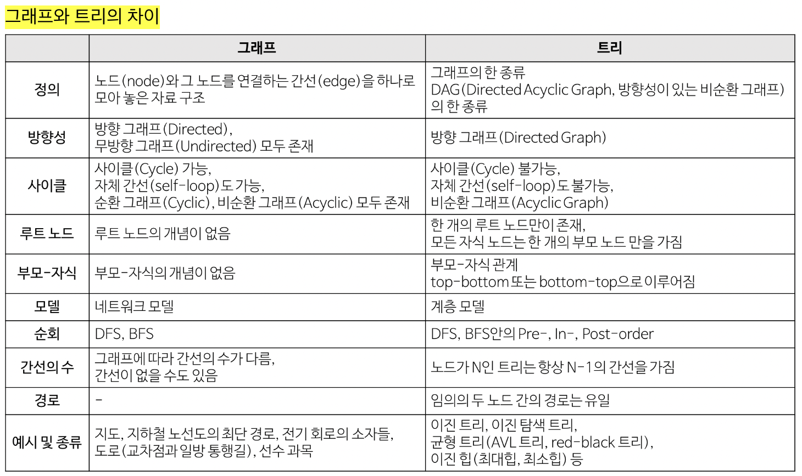

# 그래프 graph
그래프는 연결되어있는 원소간의 관계를 표현한 자료구조이다.

### 그래프의 개념
단순히 노드(node)와 그 노드를 연결하는 간선(edge)을 하나로 모아 놓은 자료구조

- 즉 연결되어 있는 객체 간의 관계를 표현할 수 있는 자료구조다.
  - ex) 지도, 지하철 노선도의 최단 경로, 전기 회로의 소자들, 도로, 선수 과목 등..
- 그래프는 여러 개의 고립된 부분 그래프로 구성될 수 있다.

### 참고
- 오일러 경로
  - 그래프에 존재하는 모든 간선을 한번만 통과하면서 처음 정점으로 되돌아오는 경로를 말한다.
  - 그래프의 모든 정점에 연결된 간선의 개수가 짝수일 때만 오일러 경로가 존재한다.

### 그래프와 관련된 용어
- 정점 : 위치라는 개념 (node 와 같은 의미)
- 간선 : 위치 간의 관계. 즉, 노드를 연결하는 선 (link, branch 라고도 부름) 
- 인접 정점 : 간선에 의해 직접 연결된 정점
- 정점의 차수 : 무방향 그래프에서 하나의 정점에 인접한 정점의 수
  - 무방향 그래프에 존재하는 정점의 모든 차수의 합 = 그래프의 간선 수의 2배
- 진입 차수 : 방향 그래프에서 외부에서 오는 간선의 수
- 진출 차수 : 방향 그래프에서 외부로 향하는 간선의 수
  - 방향 그래프에 있는 정점의 진입 차수 또는 진출 차수의 합 = 방향 그래프의 간선의 수
- 경로 길이 : 경로를 구성하는 데 사용된 간선의 수
- 단순 경로 : 경로 중에서 반복되는 정점이 없는 경우
- 사이클 : 단순 경로의 시작 정점과 종료 정점이 동일한 경우

### 그래프의 특징
- 그래프는 **네트워크 모델**이다.
- 2개 이상의 경로가 가능하다
  - 즉, 노드를 사이에 무방향/방향에서 양방향 경로를 가질 수 있다.
  - self-loop 뿐만 아니라 loop/circuit 모두 가능하다.
  - 루트 노드라는 개념이 없다.
  - 부모-자식 관계라는 개념이 없다.
  - 순회는 DFS, BFS로 우리어진다.
  - 그래프는 순환 혹은 비순환이다.
  - 그래프는 크게 방향 그래프와 무방향 그래프가 있다.
  - 간선의 유무는 그래프에 따라 다르다.

### 그래프의 종류

#### 무방향 vs 방향
- 무방향 그래프
  - 무방향 그래프의 간선은 간선을 통해서 양 방향으로 갈 수 있다.
  - 정점 A와 정점 B를 연결하는 간선은 (A,B)와 같이 정점의 쌍으로 표현한다.
    - (A,B) == (B,A)
    - ex) 양방향 통행 도로
- 방향 그래프
  - 간선에 방향성이 존재하는 그래프
  - A -> B로만 갈 수 있는 간선은 <\A,B>로 표현한다.
    - <\A,B> != <\B,A>
  - ex) 일반 통행

 

### 가중치 그래프
- 간선에 비용이나 가중치가 할당된 그래프
- 네트워크라고도 한다.
    - ex : 도시-도시 연결, 도로의 길이, 회로 소자의 용량, 통신망 사용료 등

### 연결 그래프 vs 비연결 그래프
- 연결 그래프
  - 무방향 그래프에 있는 모든 정점쌍에 대해서 항상 경로가 존재하는 경우
  - ex) 트리 : 사이클을 가지지 않는 연결 그래프
- 비연결 그래프
  - 무방향 그래프에서 특정 정점쌍 사이에 경로가 존재하지 않는 경우

### 사이클 vs 비순환 그래프
- 사이클
  - 단순 경로의 시작 정점과 종료 정점이 동일한 경우
  - 단순 경로 : 경로 중에서 반복되는 정점이 없는 경우
- 비순환 그래프
  - 사이클이 없는 그래프

### 완전 그래프
- 완전 그래프
  - 그래프에 속해 있는 모든 정점이 서로 연결되어 있는 그래프
  - 무방향 완전 그래프
    - 정점 수 : n이면 간선의 수 : n * (n-1)/2
