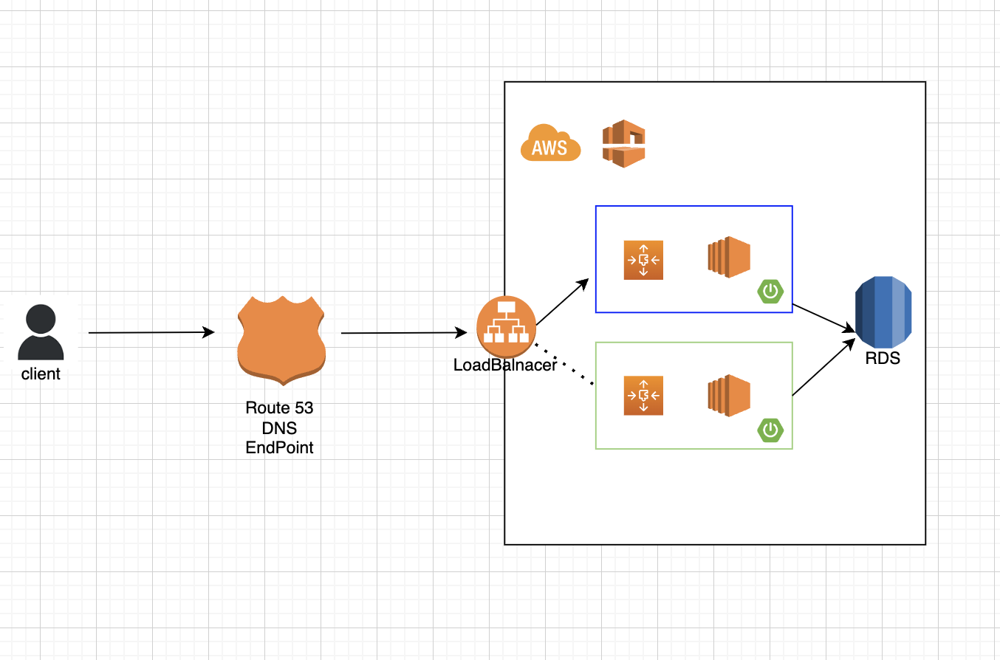

# Blue/Green 배포와 아키텍처

### 무중단 배포

말 그대로 애플리케이션의 중단 없이 배포를 하는 것을 말한다.

## Blue/Green 배포

애플리케이션의 새로운 업데이트나 변경사항을 배포할 때 다운타임 없이 처리할 수 있는 배포 전략이다.

이전에 운영 중인 환경(블루)와 스테이징 환경(그린) 두 개의 동일한 환경을 생성하고 업데이트를 그린 환경에 배포하고 충분한 테스트를 거친 후 블루 환경에서 그린 환경으로 트래픽을 전환한다.

이렇게 하면 사용자가 배포 과정에서 다운타임이나 중단 현상을 경험하지 않도록 보장할 수 있다.

구버전과 같은 환경으로 신버전을 미리 준비한다.

로드밸런서의 라우팅을 한번에 전환시킨다.

### 장점
- 구버전의 환경을 재활용하거나 롤백하기 쉽다.
- 배포 과정에서 사용자가 다운타임이나 중단 현상을 경험하지 않도록 보장할 수 있다.

### 단점
- 시스템의 자원이 두배로 든다.

## 블루그린 아키텍처

한번 블루그린 아키텍처를 짜보았다.

