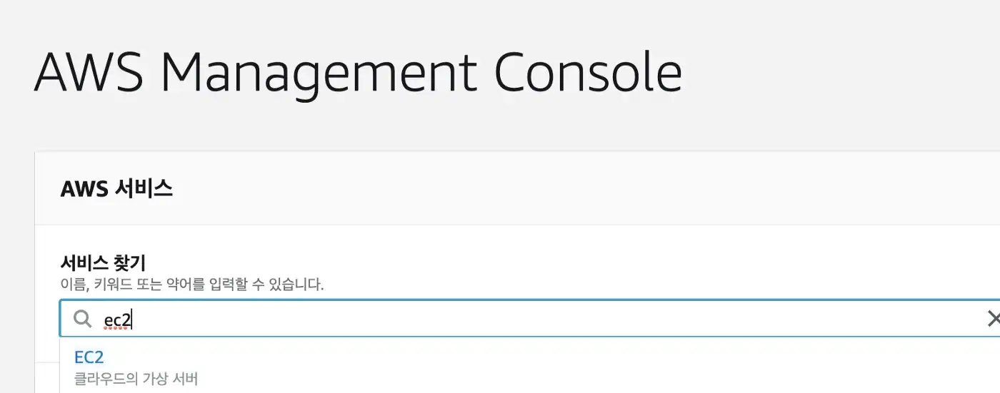
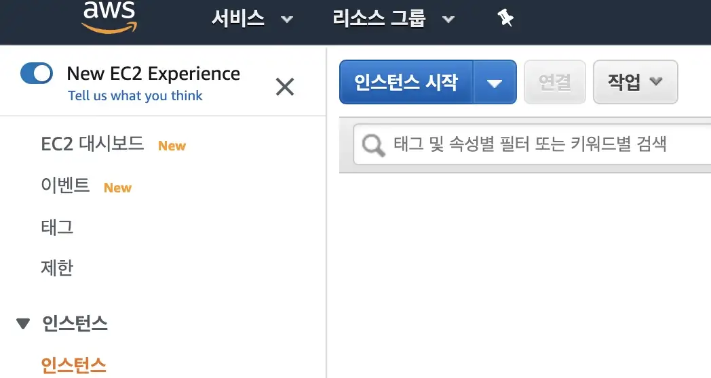
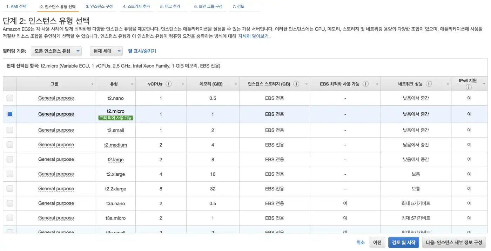
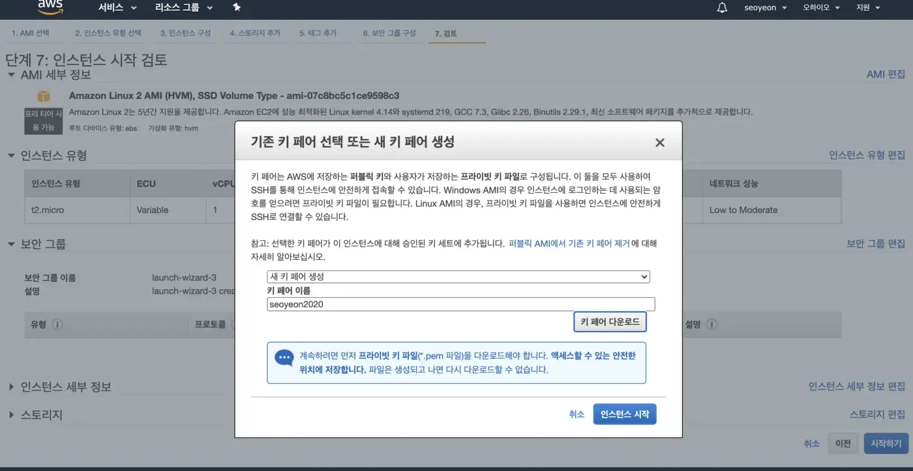
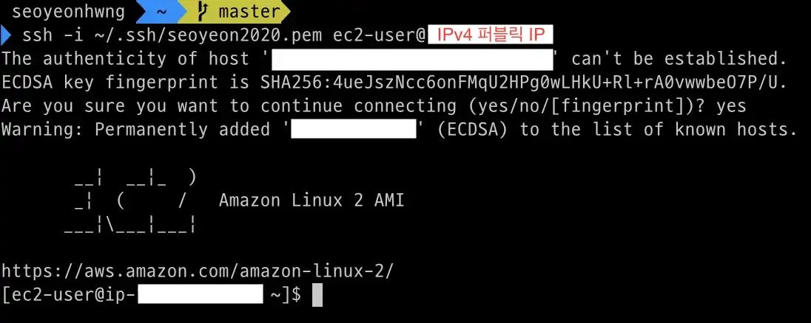
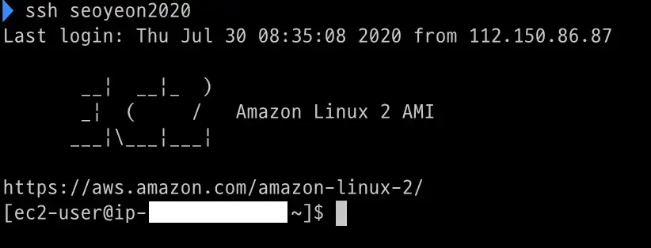

# Amazone Web Service EC2란 무엇인가

EC2는 AWS에서 가장 핵심 서비스라고 할 수 있다.  
Lambda를 사용한 서버리스 개발은 편리하지만 한계가 존재한다. 이때 서버를 구축한다면 더 많은 것을 할 수 있다.  
이 글에서는 EC2가 무엇인지 간단하게 살펴본 후, EC2 인스턴스를 생성하고 SSH 클라이언트로 인스턴스에 연결해본다. 즉, AWS를 사용하여 간단한 리눅스 서버를 구축 해보는 튜토리얼이다.

<br>

### EC2란? (Elastic Compute Cloud)
EC2는 AWS에서 재공하는 `클라우드 컴퓨팅 서비스`다.  
  
이 서비스를 통해서 아마존이 각 세계에서 구축한 데이터 센터의 서버용 컴퓨터들의 자원을 원격으로 사용할 수 있다. 쉽게 말해, 아마존으로 부터 한 대의 컴퓨터를 임대하는 것이다. AWS가 제공하는 URL을 통해 이 컴퓨터에 접근할 수 있다.  
  
EC2의 장점은 다음과 같다.
- 탄력성 : 용량을 늘리거나 줄일 수 있다.
- 사용한만큼 지불하므로 저렴하다.
- 사용자가 인스턴스를 완전히 제어할 수 있다.
- 보안 및 네트워크 구성, 스토리지 관리가 효과적이다.

### 1단계 인스턴스 생성
1. AWS EC2로 들어간다.



2. 왼쪽 메뉴에 인스턴스 > 인스턴스 시작을 클릭한다.



- 인스턴스 : 클라우드의 가상 서버

3. 원하는 AMI를 선택한다.


- AMI(Amazon machine image): 서버에서 필요한 운영체제와 여러 소프트웨어들이 적절히 구성된 템플릿
- 1단계는 운영체제를 선택하는 단계이다. 크게 Linux와 Window중에 선택할 수 있고, 튜토리얼에서는 리눅스를 선택하였다.

4. 인스턴스 유형을 선택한 후, 검토 및 시작을 클릭한다.



- 2단계는 인스턴스의 CPU, 메모리, 스토리지, 네트워킹 용량의 여러 가지 구성을 필요한만큼 선택하는 단계다.
- 다음 단계에서 더 정교하게 인스턴스 설정을 할 수 있지만 이 글을 EC2를 처음 경험하는 독자들을 대상으로 한 글이므로 3~6단계 설정은 기본값을 따른다.

5. 새로운 키 페어를 생성하고 다운로드 한 뒤, 인스턴스를 시작한다.



- 키 페어 : 퍼블릭 키 + 프라이빗 키(.pem)
- 이때 저장한 키 페어를 사용하여 해당 인스턴스에 안전하게 연결할 수 있다. 
- 프라이빗 키를 소유한 사람은 누구나 인스턴스에 연결할 수 있으므로 보안된 위치에 프라이빗 키를 저장해야 한다.

<br>

### 2단계 인스턴스 연결
SSH를 사용하여 linux 인스턴스에 연결하는 방법이다. 로컬 컴퓨터의 운영체제는 mac os 또는 리눅스다.

1. 프라이빗 키(.pem)를 보안된 위치인 .ssh 하위 디렉터리에 저장한다.

```
mv ~/Downloads/MyKeyPair.pem ~/.ssh/MyKeyPair.pem
```

2. 프라이빗 키의 권한을 설정한다.

```
chmod 400 ~/.ssh/MyKeyPair.pem
```

3. ssh 명령어로 인스턴스에 연결한다.
```
ssh -i [프라이빗 키 (.pem) 경로] [AMI의 사용자 이름]@[인스턴스의 퍼블릭 DNS]
```

- 인스턴스를 시작하는 데 사용한 AMI의 기본 사용자 이름을 가져온다.
  - Amazon Linux2 또는 Amazon Linux AMI의 경우 사용자 이름은 ec2-user입니다.
  - CentOS AMI의 경우 사용자 이름은 centos입니다.
  - Debian AMI의 경우 사용자 이름은 admin , root 입니다.
  - Febora AMI의 경우 사용자 이름은 ec2-user , fedora 입니다.
  - RHEL AMI의 경우 사용자 이름은 ec2-user , root입니다.
  - SUSE AMI의 경우 사용자 이름은 ec2-user , root 입니다.
  - Ubuntu AMI의 경우 사용자 이름은 ubuntu입니다.
  - ec2-user 및 root를 사용할 수 없는 경우 AMI 공급자에게 문의하십시요,


- 인스턴스의 퍼블릭 DNS는 IPv4 퍼블릭 IP를 적는다.



<br>

### 3단계 인스턴스에 간편하게 연결
매번 인스턴스에 퍼블릭 IP로 접속하는 것은 귀찮다. 아래의 방법으로 해당 인스턴스의 이름을 지정하여 간편하게 접근할 수 있다.

1. .ssh/config 파일을 연다.

```
vim .ssh/config
```

2. config 파일에 아래와 같은 양식으로 적는다.

- Host : 인스턴스 이름
- HostName : 인스턴스의 IPv4 퍼블릭 IP
- User : AMI의 기본 사용자 이름
- IdentityFile: 프라이빗 키의 경로


3. 이제 Host 이름으로 인스턴스에 접속할 수 있다.

```
ssh [Host 이름]
```

